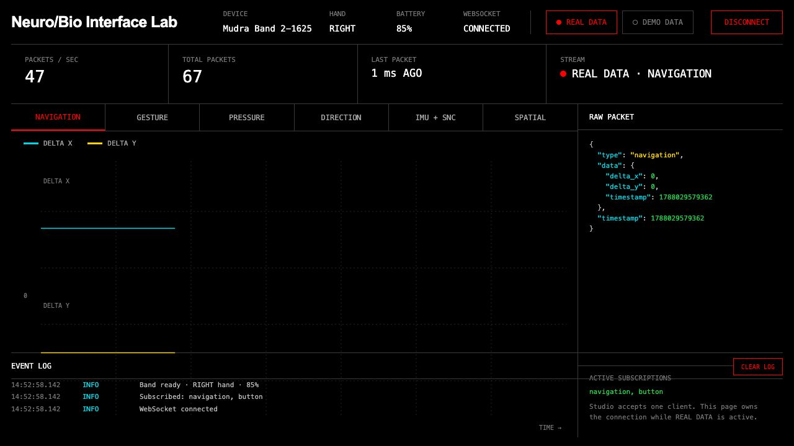
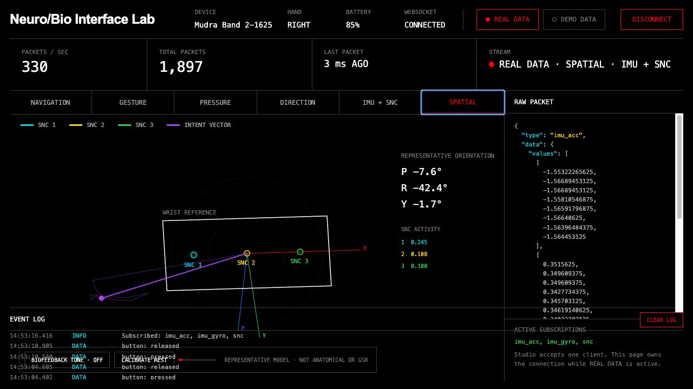

# Neuro/Bio Interface Lab

An open-source, browser-based laboratory for exploring live signals from Mudra Studio. This was my first test with the Mudra Link: a small, deliberately visual playground for seeing what the device exposes and imagining what else could be built with it.

Take it, fork it, remix it, or turn it into something entirely different. If it helps somebody make something cool, it has done its job.

[Cafe Washburn](https://cafewashburn.com) · Built by Rich Washburn



## What it does

The lab connects directly to the local Mudra Studio WebSocket server and turns the incoming stream into several focused views:

- **Navigation** — X/Y movement traces
- **Gesture** — gesture events and confidence
- **Pressure** — pressure values over time
- **Direction** — directional output
- **IMU + SNC** — inertial and surface-neural-channel signals
- **Spatial** — a representative 3D-style view combining orientation and SNC activity
- **Raw packet inspector** — the source data alongside the visualization
- **Auditory mapping** — an optional low-volume biofeedback tone driven by motion and SNC activity

The header shows connection status, the selected hand, battery level, packet rate, total packets, and time since the last packet. A clearly labeled demo source is included so the interface can be explored without hardware.



## Quick start

### Requirements

- A Mudra device with access to Mudra Studio
- Mudra Studio's local WebSocket server running at `ws://127.0.0.1:8766`
- A current desktop browser
- Python 3, or any other simple static-file server

### Run it

1. Start the WebSocket server from Mudra Studio.
2. From this repository, run:

   ```sh
   python3 -m http.server 4173
   ```

3. Open [http://127.0.0.1:4173/](http://127.0.0.1:4173/).

The page starts in **REAL DATA** mode. Mudra Studio currently accepts one WebSocket client at a time, so close or disconnect another client if the lab cannot subscribe.

There is no build step and there are no runtime dependencies: the experiment lives in a single `index.html` file.

## What the signals mean here

This project is a visualization and creative-coding experiment, not a scientific interpretation layer. The Spatial view is intentionally **representative, not anatomical**. It provides an intuitive way to talk about orientation, motion, and relative channel activity without claiming to locate activity inside the body.

The optional tone was inspired by old finger-contact biofeedback devices such as RadioShack/Micronta units. This implementation maps Mudra SNC and IMU data to sound; it does **not** measure galvanic skin response.

## Privacy and safety

- Device data stays between Mudra Studio and the page on your local machine.
- The app has no analytics, accounts, cloud storage, or external data upload.
- The Cafe Washburn title link is the only external link in the interface.
- This is not a medical device, diagnostic tool, or health measurement system.

## Make something with it

Ideas, experiments, forks, and pull requests are welcome. Some possible directions:

- Musical or haptic instruments
- Accessibility experiments
- Gesture-controlled art and games
- Signal recording and replay
- Calibration and comparative visualization tools
- New spatial, sonic, or physical interfaces

If you build on it, I would love to see where you take it.

## Status

Early experimental prototype. The incoming packet shapes and available subscriptions may change with Mudra Studio updates. This project is unofficial and is not affiliated with or endorsed by Wearable Devices Ltd. Mudra and related marks belong to their respective owner.

## License

Released under the [MIT License](LICENSE). Use it, change it, and share it.
